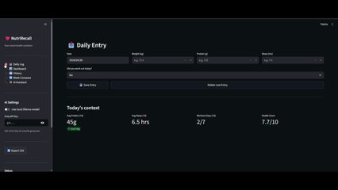
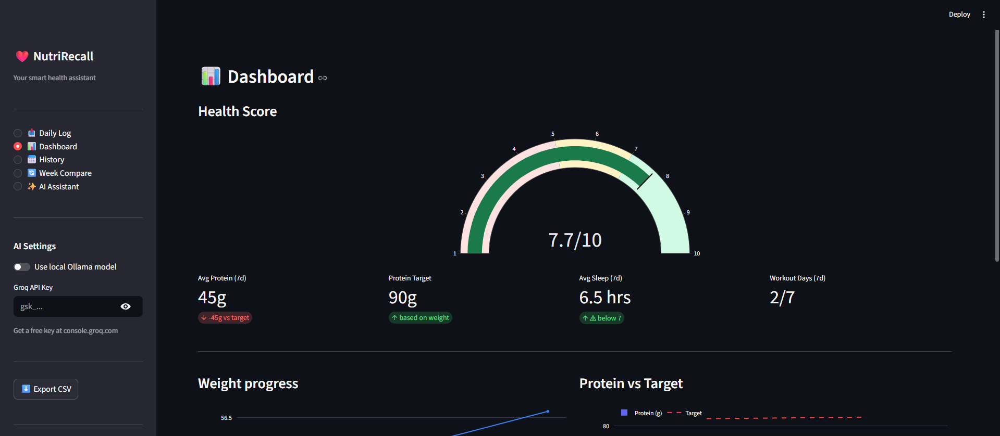

<div align="center">

# NutriRecall

### AI-Powered Personal Health Tracking & Intelligent Analysis
**Log your health. Understand your patterns. Get personalised AI advice.**


</div>

---

## What is NutriRecall?

NutriRecall is a full-stack health intelligence system that combines daily fitness logging with a **RAG (Retrieval-Augmented Generation)** pipeline to deliver personalised, data-driven advice — not generic responses.

You log your weight, protein, sleep, and workouts. NutriRecall scores your lifestyle, visualises your trends, and lets you ask an AI assistant questions like *"Why am I not gaining muscle?"* — which it answers using **your actual numbers**, not generic advice.

---
## 🚀 Demo
<p align="center">
  
</p>

---
## Features

| Feature | Description |
|---------|-------------|
| 📥 **Daily Logging** | Log weight, protein, sleep, workout with SQLite backend — duplicate entries prevented at DB level |
| 📊 **Dashboard** | Health score gauge, Plotly charts, protein vs target line |
| 📅 **History** | View, edit, or delete any past entry inline |
| 🔄 **Week Compare** | Side-by-side comparison of this week vs last week across all metrics |
| 🤖 **AI Assistant** | Full RAG pipeline — asks questions answered using your real data |
| ⬇️ **Export** | Download all your data as CSV anytime |

---
## Screenshots
### 📊 Dashboard
<p align="left">
  
</p>

### 📝 Daily Logging
<p align="left">
  
</p>

### 📅 Ai Interface
<p align="left">
  
</p>

### ✅API vs local LLM
<p align="left">
  
</p>

---
## Architecture

```
┌─────────────────────────────────────────────────────────────┐
│                        NutriRecall                          │
├──────────────┬──────────────────┬───────────────────────────┤
│   Data Layer │  Scoring Engine  │       AI Pipeline         │
│              │                  │                           │
│  SQLite DB   │  Weighted score  │  TF-IDF cosine retrieval  │
│  UNIQUE date │  protein  40%    │  ChromaDB vector memory   │
│  constraint  │  sleep    30%    │  Groq / Ollama LLM call   │
│  No CSV bugs │  workout  30%    │  Personalised response    │
└──────────────┴──────────────────┴───────────────────────────┘

User Query
    │
    ├──► TF-IDF retrieval  ──► relevant nutrition knowledge
    ├──► ChromaDB query    ──► past session memory
    └──► generate_insights ──► your 7-day summary
                │
                └──► Prompt ──► LLM ──► Personalised answer
```

**File structure:**
```
NutriRecall/
├── app.py                  ← Streamlit UI — 5 pages, sidebar nav
├── requirements.txt
├── .env.example            ← copy to .env and add your Groq key
├── utils/
│   ├── __init__.py
│   ├── db.py               ← SQLite data layer (CRUD + export)
│   └── ai.py               ← Scoring, TF-IDF retrieval, ChromaDB, LLM
├── data/
│   └── health_logs.db      ← auto-created on first run
└── chroma_db/              ← auto-created persistent vector store
```

---

## Quick Start

### 1. Clone the repo
```bash
git clone https://github.com/Sneha-pixel21/NutriRecall.git
cd NutriRecall
```

### 2. Install dependencies
```bash
pip install -r requirements.txt
```

### 3. Set up your API key
```bash
cp .env.example .env
# Open .env and add your Groq API key (free at console.groq.com)
```

### 4. Run the app
```bash
streamlit run app.py
```

App opens at **http://localhost:8502**

---

## AI Pipeline

NutriRecall uses a **RAG (Retrieval-Augmented Generation)** architecture — the LLM never answers from generic training alone. Every response is grounded in:

### 1. TF-IDF Knowledge Retrieval
A curated nutrition/fitness knowledge base (12 entries) is indexed with scikit-learn's `TfidfVectorizer`. When you ask a question, cosine similarity finds the most relevant knowledge chunks to include in the prompt.

### 2. ChromaDB Persistent Memory
Each session's health summary is stored in a local ChromaDB vector database (`PersistentClient`). Future sessions can retrieve past context — the AI remembers your history across conversations.

### 3. Health Scoring
Each day is scored using a weighted formula:

```
health_score = (0.4 × protein_score) + (0.3 × sleep_score) + (0.3 × workout_score)
```

Scaled to 1–10. Protein score = actual ÷ target (weight × 1.6g/kg).

### 4. LLM — Switchable Backend
| Mode | Model | How to enable |
|------|-------|---------------|
| ☁️ Cloud (default) | LLaMA 3.1-8b via Groq | Paste key in sidebar |
| 💻 Local | phi3:mini via Ollama | Toggle in sidebar |

---

## Tech Stack

| Layer | Technology | Why |
|-------|-----------|-----|
| UI | Streamlit | Fast, Python-native, easy to deploy |
| Data | SQLite + pandas | UNIQUE constraint prevents duplicate entries |
| Visualisation | Plotly | Interactive charts with hover tooltips |
| Knowledge retrieval | TF-IDF (scikit-learn) | Lightweight, no embedding API cost |
| Vector memory | ChromaDB PersistentClient | Survives restarts, real semantic search |
| LLM (cloud) | LLaMA 3.1 via Groq API | Free, extremely fast inference |
| LLM (local) | phi3:mini via Ollama | No API key, runs fully offline |

---

## Environment Variables

```env
# .env
GROQ_API_KEY=gsk_your_key_here   # get free at console.groq.com
```

---

## Resume / Interview Talking Points

- **RAG pipeline** — not just an LLM call; retrieval + memory + live data context
- **Persistent vector store** — ChromaDB `PersistentClient` survives kernel/server restarts
- **Hybrid LLM deployment** — cloud and local switchable at runtime without code changes
- **Proper data layer** — SQLite with UNIQUE constraint replacing error-prone CSV append
- **Modular architecture** — `db.py`, `ai.py`, `app.py` fully separated by concern

---

## License

MIT — free to use, modify, and distribute.

---

<div align="center">
Built by <a href="https://github.com/Sneha-pixel21">Sneha</a> · Powered by Groq + ChromaDB + Streamlit
</div>
